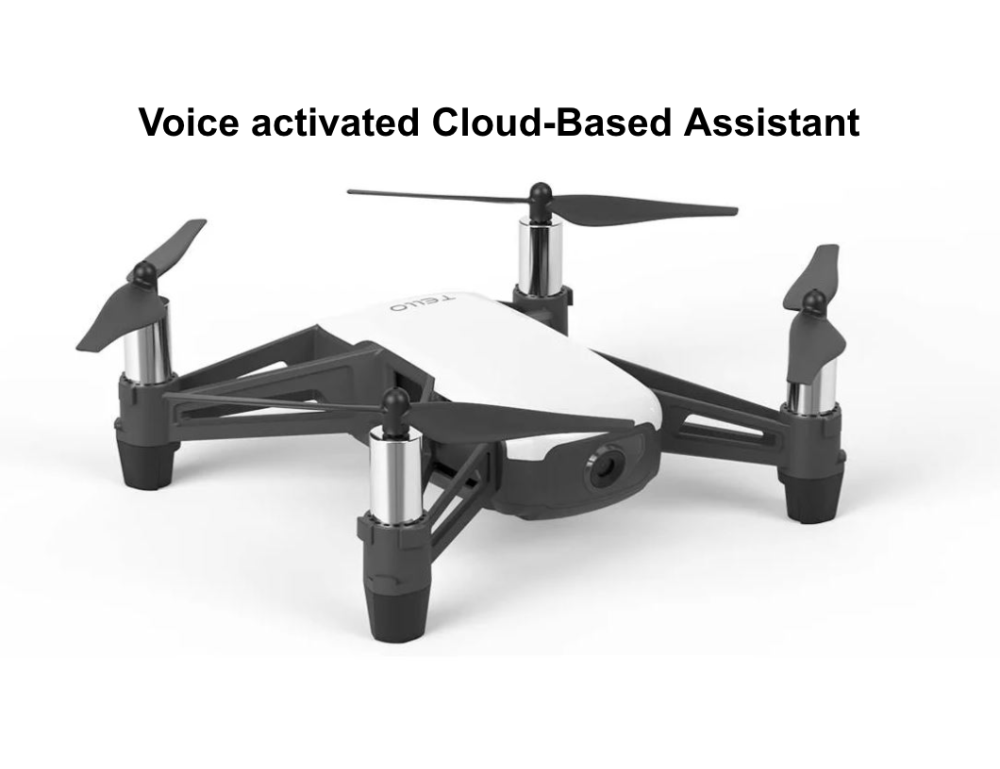
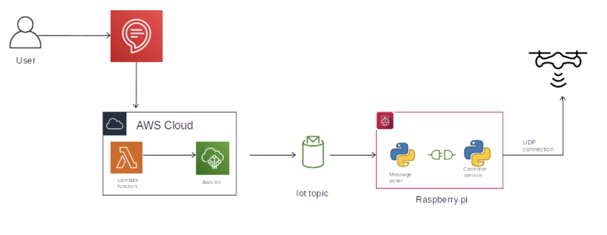
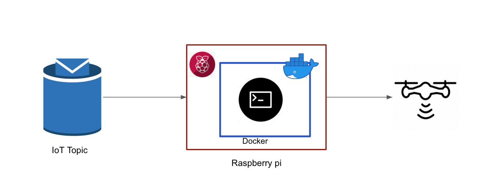
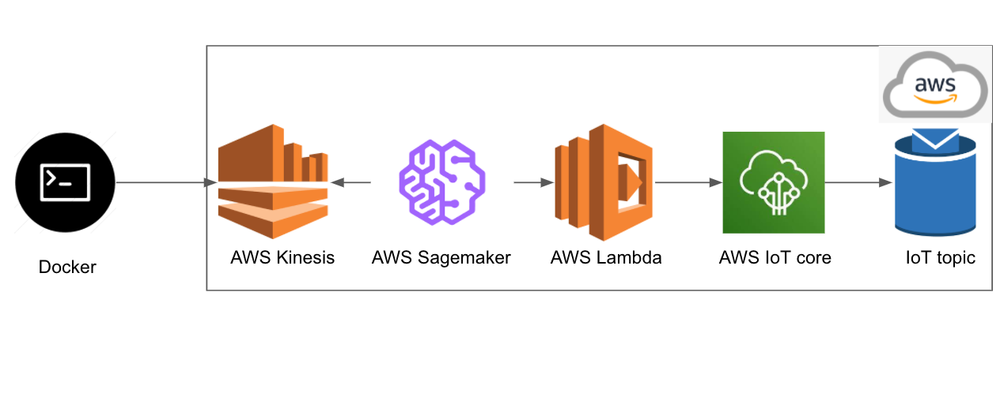
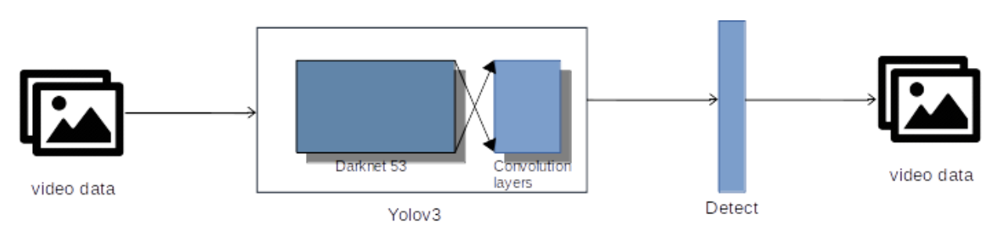
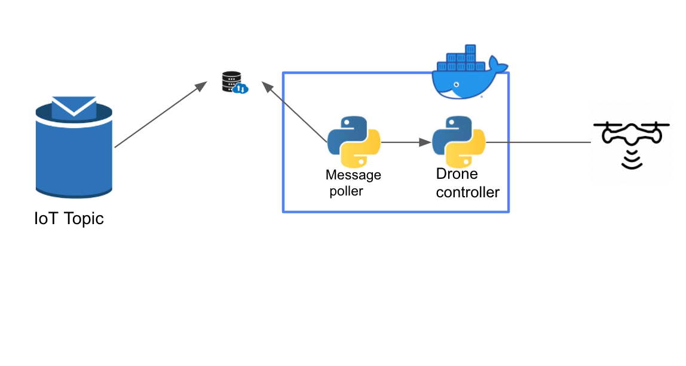

# bhoodrone-backend

<h2>Voice-activated Cloud-based Assistant</h2>

  
  

 The system is an IoT-based home automation/personal assistant. The goal of the project is to make the drone search the enclosed area for an object that is requested

<h2>Features:</h2>

- completely voice activated
- Cloud-native
- Raspberry-Pi as a server

<h4>code: https://github.com/bhuvaneswarignanasekar/bhoodrone-backend </h4>

<h2>What user sees?</h2>
User-> Alexa-> Drone find the object

<h2>What’s happening in the background?</h2>
What’s the better way to explain than with diagrams, so let me explain with few diagrams to give some idea of what’s happening in background

<h2>Architecture</h2>

  
  

  
<h2>Hardwares Requirement</h2>
- Tello DJI drone
- Raspberry pi
- Alexa/Alexa app in mobile
<h2> Software/Technology requirements</h2>
- Python3
- OpenCV
- Docker( I used linux container)
- Alexa skills kit
- AWS
<h2>AWS</h2>
- AWS Lambda
- AWS Sagemaker
- AWS Kinesis
- AWS IoT core
- AWS IoT topic
- Also experimented with AWS EC2 but didn't used in final project
<h2>Flow:</h2>

- The User interacts with the Alexa to start the drone, such as
    - Alexa, ask bhoo drone to find me “bowl”
- Here Bhoo drone is the name I gave to the system. This is the trigger command and “bowl” is the needed attribute/information.
- The information is sent the IoT topic through lambda function and AWS IoT. 
- IoT topic publishes the information to the server
- The topic published to the server is caught by the message poller, which initiates the process

  

  
- The message caught by the message poller starts the drone and starts sending the real-time video data to the AWS cloud

  

- The video data is sent to the AWS kinesis which is a video/data streaming service
- Through AWS sagemaker I read the data that is being streamed to the AWS kinesis and data is processed to detect the object.

  

- Used YOLO pre-trained model for object detection 
- The next step is decided by the system and information is sent to AWS Lambda function from AWS sagemaker
- The message is delivered to AWS IoT by AWS Lambda which then sends to the IoT Topic which publishes it to the server

  

 
- The message is then caught by the message poller and is sent to the drone controller class
- The Drone controller sends the command to the drone

<h2>DEMO:  </h2>
[click here to see the demo](http://bhoo-portfolio.s3-website-us-east-1.amazonaws.com/projectDemo)

<h2>PRESENTATION:</h2>

[click here to see the presentation](https://docs.google.com/presentation/d/1PARjfrdABAXJw3SP6z6qdkQEGS-dIR5-xWaPVJe9MSY/edit#slide=id.g9a2edfe9a3_1_9)
